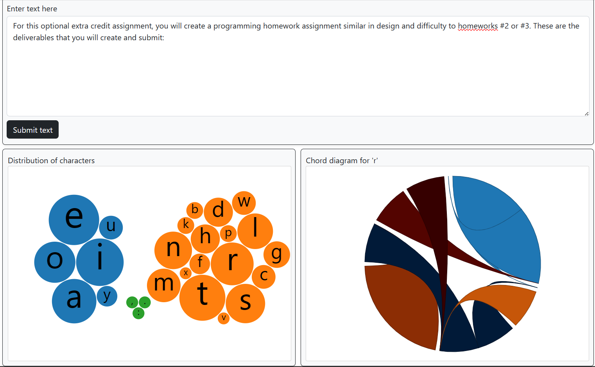
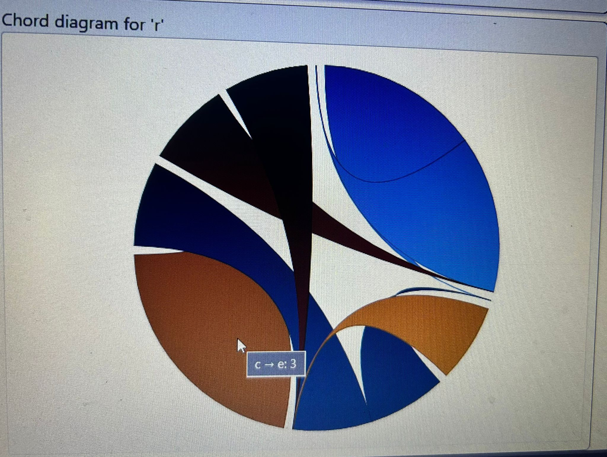

# DataVis - Linking Charts and Adding Interactivity

Website Link : https://rakshitamadhavan-datavis.netlify.app

The purpose of this homework is to give you practice interactively building and linking more complex visualizations together in D3. By the end of this assignment you should be able to:

- Dynamically create and parse a string dataset in JavaScript
- Visualize a hierarchical dataset in a bubble chart and a flow dataset in a Chord diagram
- Dynamically update charts based on user interactions
- Add an interactive tooltip

The screenshot below shows an example of what your finished interface will look like.



## Overview

The starter code for this assignment shows three panels on the `index.html` page. The top panel contains a `textarea` html element and a `submit` button. The user can enter a set of text and then click the button. This should create a bubble chart in the bottom-left panel. The bubble chart will visualize the distribution of the entered text characters based on how many times they appear in the `textarea` (i.e., each bubble will be sized based on the count of that character; a larger bubble will indicate that character appears more often). The bubble chart will also be hierarchical: consonants will be one color (and grouped together), vowels another color (grouped together), and punctuation characters a third color (grouped together). 

Clicking a bubble for a character (in the screenshot above, the `r` bubble has been clicked) will create a Chord diagram in the bottom-right panel. In the chord diagram, the links are between the previous character and next character of the selected character.

## Data Description

The text entered into the `textarea` element will consitute the dataset for your visualizations. You should assume that the entered characters will be of the following types. 
- consonants (`bcdfghjklmnpqrstvwxz`)
- vowels (`aeiouy`): for the purposes of this assignment, the letter `y` should always be considered a vowel
- punctuation (`.,!?:;`): period, comma, question mark, exclamation mark, colon, and semi-colon are required, though you may support additional characters if desired

You may ignore other characters, including spaces, line breaks, tabs, and other symbols like $, @, ", etc. 
As an example, if the user submits the following as their text:

```html
 Lorem Ipsum Dolor Sit Amet! Consectetur Adipiscing elit?
```

You would count the number of times each vowel appears in the submitted text:

```
a: 2, e: 5, i: 6, o: 4, u: 2, y: 0
 ```

Note that I'm storing the vowels in a case-insensitive manner; you should also do this! Count and store the vowels, consonants (also case-insensitive), and punctuation characters  into a hierarchical data structure that is appropriate for a treemap visualization. 

The rectangles in the treemap will be sized based on the count of the character (i.e., a bigger rectangle indicates that character appears more often), and organized based on its vowel/consonant/punctuation grouping. You may design your own categorical colormap to indicate these groups, or use a pre-defined D3 colormap. Add a small spacing/padding between the rectangles, similar to what is shown in the screenshots. When you hover on a rectangle in the treemap, display a tooltip indicating the character name and its count (see below GIF). The tooltip should smoothly follow the mouse cursor, and disapper when 
 
 When the user clicks on a rectangle, you'll create a Sankey chart in the third panel. This Sankey chart will have three columns: the middle column will show the currently selected character, the left column will show the characters that appear in the `textareaa` immediately before the selected character (with the rectangles sized based on how often this happens), and the right column will show characters that occur immediately afterwards (likewise sized). You'll need to create another dataset for this chart (i.e., one that shows which characters are found immeidately before the selected character, and how often they occur, and characters that appear after the selected character).

You can consider testing using random text generators, such as [https://loremipsum.io/generator](https://loremipsum.io/generator) when working on your page. 

## To complete the assignment

- Clone this code template to your local machine.
- Start a local server and open the `index.html` page.
- Modify the given code according to the instructions below to achieve the requested interface.
- Commit and push the code back to this repository to submit it.

## Step 0: Starting code

When you first run the page, you should see the empty interface. Add your name and email to the top. It's up to you if you want to write your JavaScript code in a separate JS file, or in the main `index.html` file.

## Step 1: Displaying a bubble chart

When the page first loads, all three panels should be blank.
When the user enters a set of text in the top panel and then clicks on the `Submit` button, you should display a treemap that shows the distrubution of grammar characters from the `textarea` (i.e., the vowel counts, the consonant counts, and the punctuation counts in the entered text).

- You'll want to first read the entered text from the `textarea` and store it in a set of one or more data structures. Every time the submit button is pressed, you'll need to clear and recreate these (and re-display the treemap).
- Your treemap should be centered inside the `#bubble_div` svg. You may choose the margin around the chart, but make it doesn't go outside of the `svg`'s bounds, and that it's not too small.
- Choose a categorical d3 color scale for this chart by picking a color scale from [https://github.com/d3/d3-scale-chromatic](https://github.com/d3/d3-scale-chromatic) or creating your own manual one. All vowels will be one color, consonants another, and puncutations a third.
- Similar to what's shown in the bubble chart, the bubbles in each group should be organized together (e.g., all vowels together). 


## Step 2: Displaying a chord diagram

When the user clicks on a bubble in the treemap, draw a Sankey diagram in the bottom right panel. Your design should look similar to what is in the screenshots. The chart should be centered in the panel (with reasonable margins, similar to the screenshots).

- If the user clicks on a different rectangle in the bubble, re-load the chord diagram for the selected character. 
- If the user clicks the `submit` text button in the top panel (thus submitting a new set of text, and re-loading the bubble chart), clear the chord diagram (make this a blank panel).
- You should also update the text at the top of this panel whenever a Sasnkey chart is loaded/cleared. When no chart is shown, the text should say `Character flow for ...`. When a character is selected, it should say `Character flow for 'char'`, where `char` is the selected character.

| 🔍 **Hint:** D3 does not contain a `chord` function in its base library, so you'll need to import one.



## Step 3: Add a hover tooltip to the two charts


Finally, add a tooltip to the two charts. When the user hovers over a bubble in the treemap, display the name of the hovered character and the count for that character.